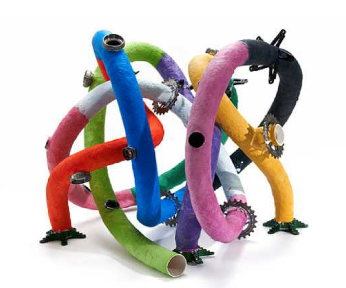

##  **SFM2-SS16-ToDo**

Description: For the student projects of SFM2 SS16

__This repository includes:__
- Data2004-2014: The dataset used to update the Qs. (Q = Quantlet)
- Every Q has to be in its own subfolder in the repository, e.g. [SFEReturns](https://github.com/QuantLet/SFE-ToDo/tree/master/SFEReturns)
- Styleguide and FAQ - [General Rules](https://github.com/QuantLet/Styleguide-and-FAQ)

__Workflow:__
- Find the corresponding Q of your project (if not, search [SFE-Ready](https://github.com/QuantLet/SFE-Ready) and send me the name of Q)
- Clone to your local folder
- Repair the Q with the new dataset
- Pull request to the master

__Q respository:__

Every QuantLet Repository consists of four elementary parts (Readme.md is not included because it can be automatically provided to your repository by Q team):
- input, e.g. dataset
- code
- output, e.g. figure
- Metainfo.txt 
