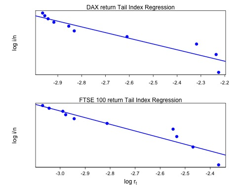

[](http://quantlet.de/index.php?p=info)

## [](http://quantlet.de/) **SFEtail** [](http://quantlet.de/d3/ia)

```yaml

Name of QuantLet : SFEtail

Published in : Statistics of Financial Markets

Description : 'Reads the date, DAX index values, stock prices of 30 largest companies at Frankfurt
Stock Exchange (FSE), FTSE 100 index values and stock prices of 100 largest companies at London
Stock Exchange (LSE) and plots the right sides of the logged empirical distributions of the DAX and
FTSE 100 daily returns from 2004 to 2014 (m=10).'

Keywords : 'asset, data visualization, dax, descriptive-statistics, financial, ftse100, graphical
representation, index, log-returns, plot, regression, returns, stock-price, tail, time-series'

See also : SFElshill, SFEmvol01, SFEmvol03, SFEtimeret, SFEvolgarchest, SFEvolnonparest

Author : Andrija Mihoci, Awdesch Melzer, Felix Jung

Submitted : Mon, August 01 2016 by Shi Chen

Datafiles : 2004-2014_dax_ftse.csv

Example : 'Plots of the tail index regression lines and log observed returns of the DAX index and
FTSE 100 from 2004 to 2014.'

```




### R Code:
```r
# Set your working directory here
# setwd("C:/...")

# Close windows and clear variables
graphics.off()
rm(list = ls(all = TRUE))

# Read in text data as string instead of factor
options(stringsAsFactors = FALSE)

# Save default parameters
plotmfrow  = par("mfrow")
plotmar    = par("mar")

# Read in data as dataframe
df         = read.csv("2004-2014_dax_ftse.csv")

# Compute log-returns of DAX 30 and FTSE 100
dax        = diff(log(df$DAX.30),   1)
ftse       = diff(log(df$FTSE.100), 1)
date       = df$Date

n          = length(dax)
i          = c(1:n)
m          = 10

# Form order statistic
dax_o      = dax[order(- dax)]
ftse_o     = ftse[order(- ftse)]

# Estimate P(x) by relative frequency
px         = i/n

# Estimate tail index regression model using m observations
# DAX
model_dax  = lm(log(px[1:m]) ~ log(dax_o[1:m]))

log_k_dax  = model$coefficients[1]
a_dax      = - model$coefficients[2]

plot(log(dax_o[1:m]), log(px[1:m]))
abline(model_dax)

# FTSE 100
model_ftse = lm(log(px[1:m]) ~ log(ftse_o[1:m]))

log_k_ftse = model$coefficients[1]
a_ftse     = - model$coefficients[2]

plot(log(ftse_o[1:m]), log(px[1:m]))
abline(model_ftse)

# Plot results
par(mfrow = c(2, 1), mar=c(2.5, 5, 1.5, 3))

# Plot Results for DAX
plot(log(dax_o[1:m]), log(px[1:m]),  pch = 21, col = "blue",
	bg = "blue", axes = FALSE, ylab = "", xlab = "", main = "")
box(which = "plot", lty = "solid")
abline(model_dax, col = "blue", lwd = 2)

axis(1, lwd = 1, cex.axis = 1.3, at = seq(- 2, - 3.5, by = - 0.1),
	lab = NA, tck = - 0.03)
axis(1, lwd  = 0, at = seq(- 2, - 3.5, by= - 0.1), line = - 0.5,
	cex.axis = 0.85)

axis(2, lwd = 1, cex.axis = 1.3, at = seq(0, - 5, by = - 0.5), lab = NA,
	cex.axis = 1.3, tck = - 0.025)
axis(2, lwd = 0, at = seq(0, - 5, by= - 0.5), line = -0.30, cex.axis = 0.75,
	las=2)

mtext(side = 3, "DAX return Tail Index Regression" , line = 0, cex = 1,
	xaxs = "i")
mtext(side = 2, "log i/n" , line = 2.5, cex = 1, xaxs = "i")


# Plot Results for FTSE
plot(log(ftse_o[1:m]), log(px[1:m]), pch = 21, col = "blue", bg = "blue",
	axes = FALSE, ylab = "", xlab = "", main = "")
box(which = "plot", lty = "solid")
abline(model_ftse, col = "blue", lwd = 2)

axis(1, lwd = 1, cex.axis = 1.3, at = seq(- 2, - 3.5, by = - 0.1), lab = NA,
	tck = - 0.03)
axis(1, lwd = 0, at = seq(- 2, - 3.5, by = - 0.1), line = - 0.7,
	cex.axis = 0.85)

axis(2,lwd = 1, cex.axis = 1.3, at = seq(0, - 5, by= - 0.5), lab = NA,
	cex.axis = 1.3, tck = - 0.025)
axis(2, lwd = 0, at = seq(0, - 5, by= - 0.5), line = -0.30, cex.axis = 0.75,
	las = 2)

mtext(side = 3, "FTSE 100 return Tail Index Regression", line = 0, cex = 1,
	xaxs = "i")
mtext(side = 1, expression('log r'[t]) , line = 1.6, cex = 1, xaxs = "i")
mtext(side = 2, "log i/n" , line = 2.5, cex = 1, xaxs = "i")

# Restore original plotting parameters
par(mfrow = plotmfrow, mar = plotmar) 

# Remove comment if you want to save plot as jpeg
# dev.print(jpeg, file="SFEtail.jpg", width = 500, height = 375, quality = 100)
```
